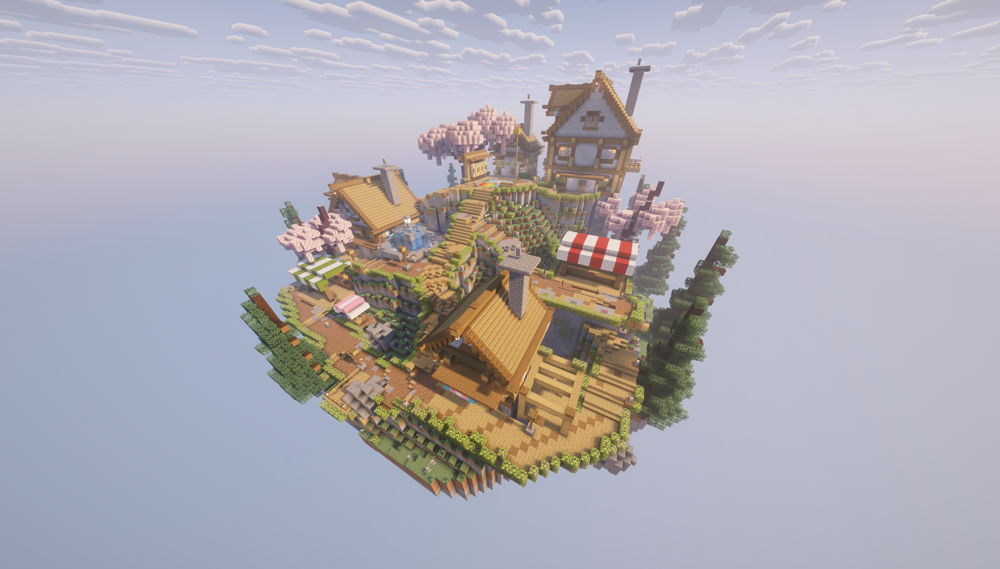

# Momo Land

Momo Land 的玩家说明。这里介绍服务器里的常用指令、商店和日常玩法，忘记怎么用时来翻一下就好。

*服务器实景，由服主提供。*

## 从这里开始

进服后输入 **`/menu`** 打开服务器面板。生存一区、生存二区、每日任务、签到和挂机池都能从这里进入。

想直接回自己的家，用 **`/home world`** 或 **`/home world_new`**。回主城用 **`/spawn`**。

---

## 玩法说明

### 主城与传送

- [主城与服务器面板](docs/lobby.md)
- [生存世界与 Home](docs/home.md)
- [玩家传送](docs/teleport.md)

### 日常功能

- [签到与每日任务](docs/daily.md)
- [金币、经验与等级](docs/profile.md)
- [服务器背包](docs/bag.md)
- [挂机池](docs/afk.md)

### 商店与头衔

- [服务器商店与每日附魔书](docs/store.md)
- [商品价目表](docs/prices.md)
- [Yuki / Momo / Neko](docs/titles.md)

### 查询与帮助

- [命令速查](docs/commands.md)
- [TAB、聊天与隐私](docs/privacy.md)
- [常见问题](docs/faq.md)
- [问题反馈与投喂](docs/contact.md)
- [1.4.4 更新说明](docs/updates.md)

---

## 社群与联系

一起聊聊、分享建筑：[加入 Discord](https://discord.gg/RfDVARQt5) · QQ 交流群：**790754858**

服务器问题和玩家报告：**[hasaki.0612@outlook.com](mailto:hasaki.0612@outlook.com)**

自愿投喂：**[爱发电](https://ifdian.net/a/neko_0612)**

> [!NOTE]
> 本说明按 NekoCore **1.4.4** 编写。奖励、价格和冷却列的是插件默认值；服内有调整时，以游戏界面和服主说明为准。
> NekoCore 公版仓库地址：**https://github.com/hasaki0612-lab/NekoCore**
