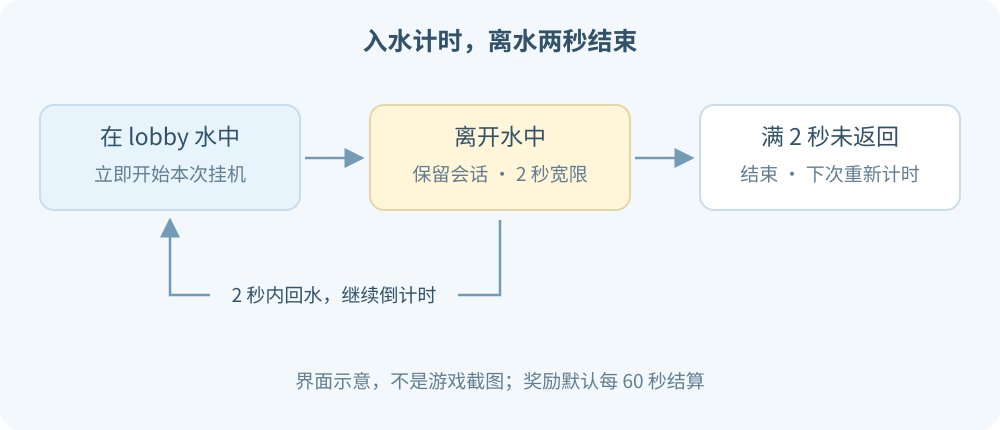

# 挂机池

从 **`/menu` → 挂机池** 进入。默认在大厅 `lobby` 的 `-10.5, 54, 33.5`。

## 开始与结束

在大厅实际进入水中，就开始本次挂机，不要求站着不动。

- 离水后有 **2 秒**宽限。
- 2 秒内回到水中，继续原倒计时。
- 连续离水满 2 秒，本次结束；再进水重新计时。
- 换世界、死亡或退出也会结束，没有离线收益。

旁观者模式不进入挂机状态。

---

## 奖励

默认 **每 60 秒**结算一次：

| 最高已拥有头衔 | 每轮 NekoCore EXP |
| --- | ---: |
| 无 / Yuki / Momo | 11 |
| Neko | 12 |

每轮还有 **45% 概率**获得 **1～4 金币**。没有抽到金币，也会获得本轮 EXP。

Neko 加成按“已经拥有”计算，不要求当前佩戴 Neko。加成只作用于挂机 EXP，不会改变签到、任务等其他奖励。

## 屏幕提示

挂机时中央显示标题和奖励倒计时，**只有自己看得到**，不是水池里给所有人看的悬浮字。

打开菜单、商店或其他物品栏时，挂机标题暂时隐藏，计时照常继续。

正常离水结束，或在线切换世界时，聊天会提示：

> ✦ 挂机结束啦 · 本次挂机 3分18秒

这是从本次进入到正式结束的时长，包含离水宽限。直接退出、插件重载或关服不发送结束聊天。

[返回目录](../README.md) · [头衔权益](titles.md)

