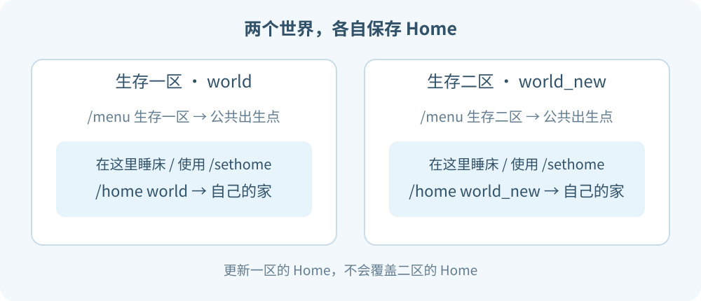

# 生存世界与 Home

服务器有两个并行的生存区：

| 世界 | 名称 | 回家指令 |
| --- | --- | --- |
| `world` | 生存一区 | `/home world` |
| `world_new` | 生存二区 | `/home world_new` |

两个世界各保存一个 Home，互不覆盖。不是给同一个家取两个名字。

---

## 设置家

**`/sethome`**

把当前位置保存成**当前世界**的 Home。再次使用会覆盖这个世界原来的位置。

在生存一区或二区**成功躺上床**，也会自动保存床边的安全位置。保存成功后，聊天会告诉你世界名、坐标和回家指令。

> [!NOTE]
> 睡床会更新该世界的 Home。换了床，就注意看新的坐标提示。

## 返回家

**`/home`**

返回当前所在世界的 Home。例如你在大厅执行，就查大厅的 Home，不会自动选生存区。

**`/home world`**

返回生存一区的 Home，可以从其他世界使用。

**`/home world_new`**

返回生存二区的 Home，可以从其他世界使用。

Home 没有 `/spawn` 那样的等待流程。目标世界需要已经加载，也需要先设置过 Home。

## 查看坐标

**`/check home world`** 或 **`/check home world_new`**

只查看自己的对应 Home，不会传送。

---

## 菜单入口与 Home 的区别

- `/menu` 的生存入口：去该世界**公共出生点**。
- `/home <世界名>`：去自己的**已保存据点**。

死亡后的重生地点由服务器的世界配置决定，Home 本身不接管重生。

[返回目录](../README.md) · [玩家传送](teleport.md)

