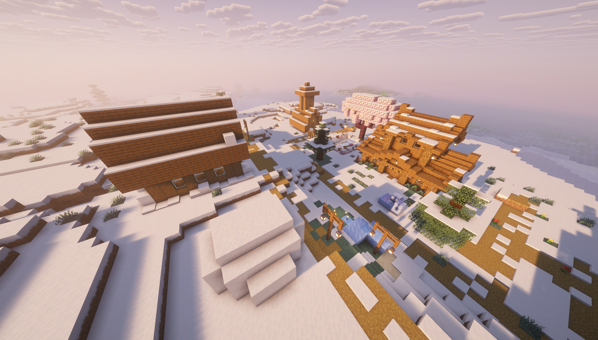

# 主城与服务器面板

**`/menu`** 打开面板，点击图标使用对应功能。大厅 NPC 也可以作为功能入口。

## 面板里有什么

| 入口 | 用途 |
| --- | --- |
| 玩家资料 | 查看等级、经验、金币和游玩时间 |
| 每日任务 | 查看今日目标和自己的进度 |
| 每日签到 | 领取当天奖励 |
| 显示网络地区 | 开关自己的地区前缀 |
| 生存一区 | 前往 `world` 公共出生点 |
| 生存二区 | 前往 `world_new` 公共出生点 |
| 小游戏区 | 前往大厅的小游戏入口位置 |
| 挂机池 | 前往大厅水池 |

> [!NOTE]
> 小游戏区目前是传送入口，不代表已经开放完整的小游戏玩法。

---

## 回主城

**`/spawn`** 由独立 NekoSpawn 提供，返回大厅的等待和取消规则按聊天提示操作。

生存入口不会把你送回上次离开的位置。想回据点，请使用 [Home](home.md)。

## 小鲸鱼娘

主城的 DeepSeek NPC 是“小鲸鱼娘”。主手右键可以收到一条随机回复，旁边也会出现少量粒子。

每人 15 秒内前 5 次是正常互动；再连续戳，她会冒烟、提醒你慢一点。超限回复有 2 秒间隔。

这是预设对话，不是联网 AI 问答。

---

## 服务器预览

*服主提供的另一张服务器实景。画面效果会随客户端光影和天气变化。*

[返回目录](../README.md) · [命令速查](commands.md)

